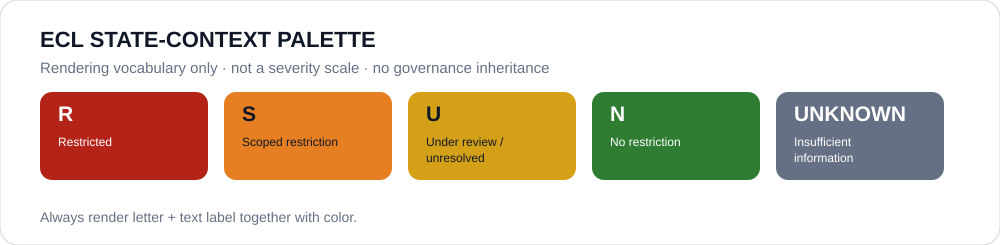

# Evidence dossiers

Dossiers are the canonical per-entity evidence/governance records for ECL.

- `states/` — 195 State dossiers.
- `agencies/` — agency/department/service dossiers.
- `institutions/` — courts, constitutional bodies, ombudsmen, NHRIs and other institutional dossiers.
- `organizations/` — organization/legal-entity dossiers.
- `persons/` — individualized natural-person dossiers.
- `projects/` — project/program/deployment dossiers.
- `assets/generated/` — deterministic derived status cards and evidence diagrams.
- `evidence-images/` — provenance-controlled source facsimiles when reuse/storage is permitted.

A dossier has **no licensing effect by itself**.

## Canonical per-entity dossier rule

A non-State `knowledge/entities/*.json` record is **not** dossier-complete merely because its `dossier` field resolves to a State dossier. State dossiers may be provenance, but a canonical entity dossier must live under the directory for that entity's own type.

The migration is ratcheted by `knowledge/generated/canonical-entity-dossier-migration-v*.json` and checked by `tools/check_canonical_entity_dossiers.py`. A migrated row must have:

- a stable entity identity and type;
- a dedicated dossier with matching `ECL-<entity-id>` frontmatter;
- explicit identity, evidence, attribution/exclusion, evidence-gap, source and governance-boundary sections;
- no inherited `provisional_outcome`;
- at least one status-context visual and one derived evidence diagram.

This rule closes the distinction between **ABox identity existence** and **canonical per-entity evidence completeness**.

## Visual evidence

Visual evidence is governed by `../spec/VISUAL-EVIDENCE.md`.

The canonical State-context palette is:

The colors are rendering vocabulary, not a severity score:

- `R` — `#B42318`
- `S` — `#E67E22`
- `U` — `#D4A017`
- `N` — `#2E7D32`
- unknown / insufficient information — `#667085`

Color must never be the sole carrier of meaning; the state letter and text label travel with every swatch. A non-State dossier may display the State dossier's color only as explicitly labeled **State governance context**. It does not inherit that State outcome.

Generated diagrams are reproducible from versioned data with `tools/render_dossier_visuals.py`. Source screenshots or source figures are a separate evidence class: they may be stored only with provenance, capture date, integrity hash and an explicit reuse/storage basis. Decorative or AI-generated imagery must never be presented as evidence.

## Historical evidence absorption

A dossier being canonical and self-contained does not mean every historical review sentence is copied into it. Historical material under `../reviews/2026/` and GitHub review issues remains provenance, while the dossier carries the current human synthesis needed to understand and audit the present state.

During ECL 1.0 evidence normalization, historical sources are handled explicitly:

- **absorbed** — missing substantive evidence, counter-evidence, uncertainty, attribution context or remediation is normalized into the dossier with provenance;
- **already represented** — the historical source has been reviewed and its substantive current content is already present, so it is not duplicated merely to prove migration;
- **historical-only / locator incomplete** — the record is preserved as provenance but is not promoted into the current evidence basis when its locator or current applicability is insufficient;
- **open conflict/gap** — a material disagreement or unresolved curation problem remains explicit rather than being silently reconciled.

Unreviewed historical material must never be presented as migrated. Source families without a precise historical locator must not be given fabricated precision.

This dossier-normalization work is human curation. It does **not** convert prose into `Claim` or `EvidenceItem` records, assign evidence grades, invent `asOf` dates, or execute Claim predicates as functional triples. Structured Claim/Evidence curation remains governed by `../spec/CLAIM-EVIDENCE-CURATION.md`, `../spec/EVIDENCE-VALUATION.md`, and `../spec/KNOWLEDGE-MODEL.md`.

Historical review files and GitHub issues are retained; normalization changes their role from required reconstruction material toward provenance/history.

## Current State source

All 195 State dossiers are normalized and self-contained.

Read `../registry/states.yml`, then apply every `../registry/state-outcome-overrides*.yml` in lexical order for current State governance.

## Current Schedule sources

Use:

- `../registry/schedule-progress-overrides.yml`
- `../registry/schedule-status-overrides.yml`
- `../registry/schedule-state-r-freeze.yml`
- `../registry/schedule-state-s-freezes/`
- `../registry/schedule-organization-freezes.yml`
- `../registry/schedule-armed-organization-freezes.yml`
- `../registry/schedule-project-freezes.yml`

A Schedule entry may be narrower than its supporting dossier. Residual unfrozen scope remains governance-only.

Only an exact Schedule expressly incorporated with an exact ECL version can have licensing effect.
