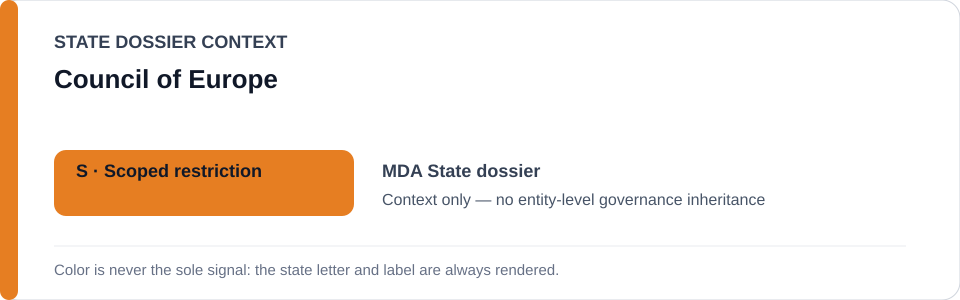
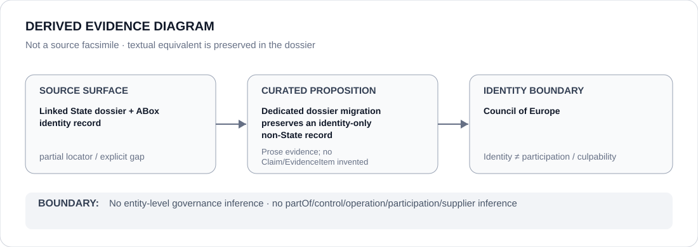

# Council of Europe

- Entity ID: `ORG-COUNCIL-OF-EUROPE`
- Entity type: `Organization`
- Canonical dossier: `dossiers/organizations/COUNCIL-OF-EUROPE.md`

## Identity scope
Dedicated canonical record for `ORG-COUNCIL-OF-EUROPE`; identity and aliases remain authoritative in `knowledge/entities/ORG-COUNCIL-OF-EUROPE.json`.

## Linked governance context
Migration source: `dossiers/states/MDA.md`. The link supplies context only and does not transfer a State governance classification.

## Evidence record
This migration materializes the existing entity boundary; it asserts no new event, relationship, or outcome.

## Attribution and exclusions
Only directly attributable Organization evidence belongs here; State and other entity records remain separate.

## Visual evidence

## Evidence gaps
Direct entity-level evidence beyond the linked source remains to be curated where absent.

## Sources
- `knowledge/entities/ORG-COUNCIL-OF-EUROPE.json`
- `dossiers/states/MDA.md`

## Governance boundary
This Organization dossier does not classify a State or inherit linked-State governance status.
