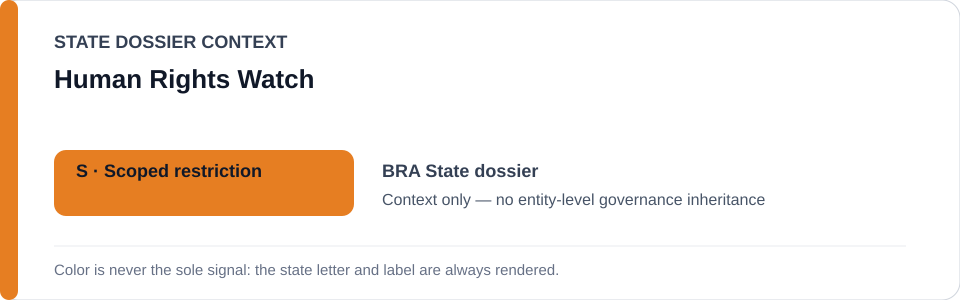
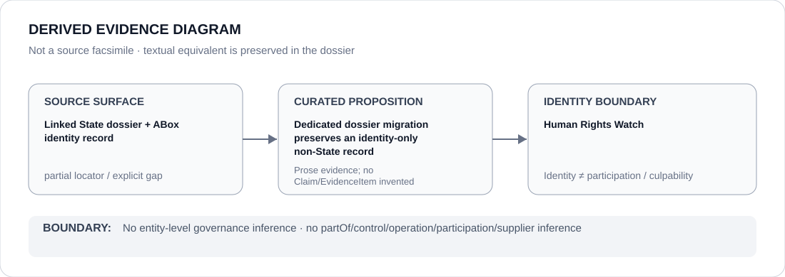

# Human Rights Watch

- Entity ID: `ORG-HUMAN-RIGHTS-WATCH`
- Entity type: `Organization`

## Identity scope
Dedicated canonical record for `ORG-HUMAN-RIGHTS-WATCH`; the entity JSON remains authoritative for identity and aliases.
## Linked governance context
Migration source: `dossiers/states/TUR.md`; this is contextual linkage only.
## Evidence record
This migration materializes the existing documentary-source boundary and asserts no new outcome.
## Attribution and exclusions
Only directly attributable Organization evidence belongs here; cited reporting does not transfer attribution.
## Visual evidence

## Evidence gaps
Further direct entity-level evidence remains to be curated where absent.
## Sources
- `knowledge/entities/ORG-HUMAN-RIGHTS-WATCH.json`
- `dossiers/states/TUR.md`
## Governance boundary
This Organization dossier does not classify or inherit the governance status of a linked State.
