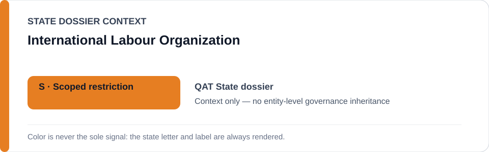
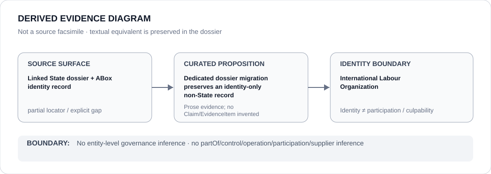

# International Labour Organization

- Entity ID: `ORG-ILO`
- Entity type: `Organization`

## Identity scope
Dedicated canonical record for `ORG-ILO`; identity and aliases remain authoritative in its entity JSON.
## Linked governance context
Migration source: `dossiers/states/QAT.md`; technical cooperation is context, not an inherited ECL outcome.
## Evidence record
This migration asserts no new event, relationship, or outcome.
## Attribution and exclusions
Labour-reform and counter-evidence provenance remains proposition-specific.
## Visual evidence

## Evidence gaps
Further direct entity-level evidence remains to be curated where absent.
## Sources
- `knowledge/entities/ORG-ILO.json`
- `dossiers/states/QAT.md`
## Governance boundary
This Organization dossier does not classify or inherit a linked State's governance status.
