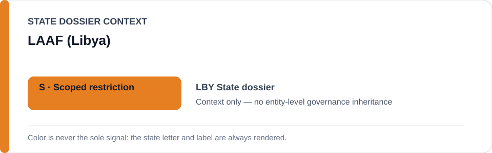
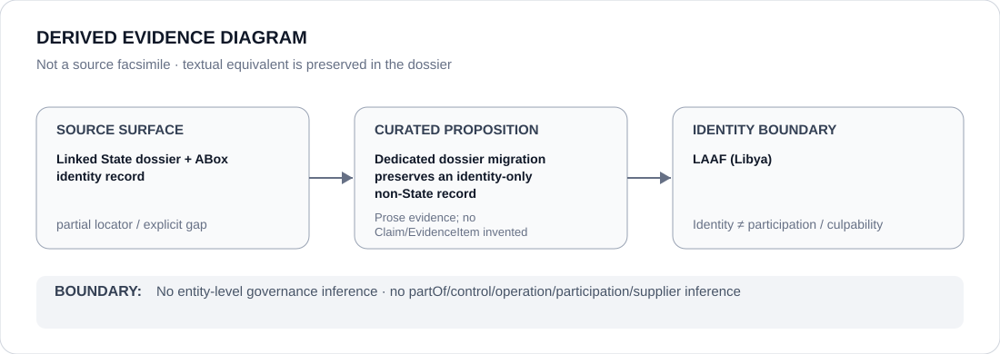

# LAAF (Libya)

- Entity ID: `ORG-LBY-LAAF`
- Entity type: `Organization`

## Identity scope
Dedicated canonical record for `ORG-LBY-LAAF`.
## Linked governance context
Migration source: `dossiers/states/LBY.md`; Libya's fragmented context does not transfer attribution.
## Evidence record
This migration asserts no new conduct or relationship.
## Attribution and exclusions
No conduct propagates to unrelated Libyan actors; actor-specific attribution remains required.
## Visual evidence

## Evidence gaps
Further direct entity-level evidence remains to be curated where absent.
## Sources
- `knowledge/entities/ORG-LBY-LAAF.json`
- `dossiers/states/LBY.md`
## Governance boundary
This Organization dossier does not classify or inherit a linked State's governance status.
