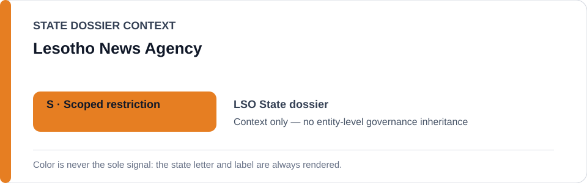
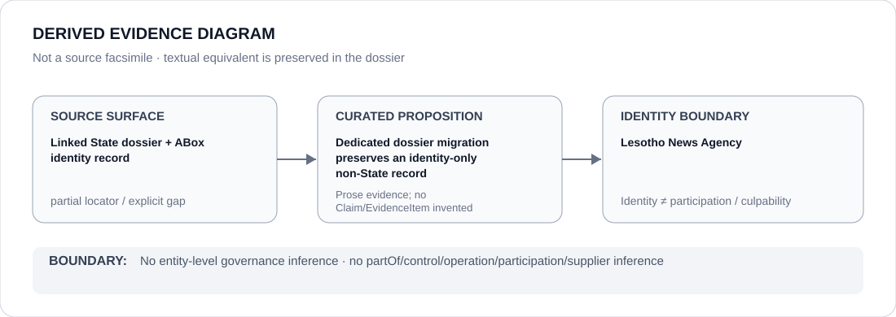

# Lesotho News Agency

- Entity ID: `ORG-LSO-LENA`
- Entity type: `Organization`

## Identity scope
Dedicated canonical record for `ORG-LSO-LENA`.
## Linked governance context
Migration source: `dossiers/states/LSO.md`; source provenance is contextual only.
## Evidence record
This migration asserts no new event, relationship, or outcome.
## Attribution and exclusions
Citation as a news source does not itself create governance or actor attribution.
## Visual evidence

## Evidence gaps
Further direct entity-level evidence remains to be curated where absent.
## Sources
- `knowledge/entities/ORG-LSO-LENA.json`
- `dossiers/states/LSO.md`
## Governance boundary
This Organization dossier does not classify or inherit a linked State's governance status.
