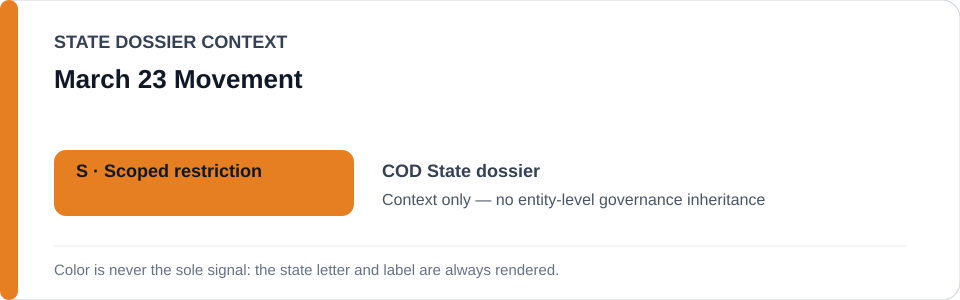
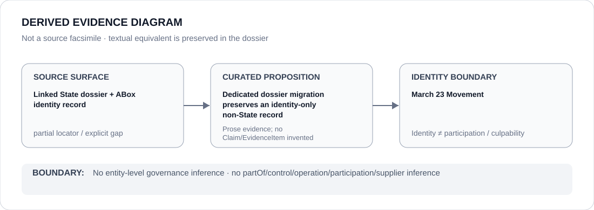

# March 23 Movement

- Entity ID: `ORG-M23`
- Entity type: `Organization`

## Identity scope
Dedicated canonical record for `ORG-M23`.
## Linked governance context
Migration source: `dossiers/states/COD.md`; geography and co-occurrence do not create sponsorship, control, participation, or governance relations.
## Evidence record
This migration materializes the existing actor boundary and asserts no new conduct.
## Attribution and exclusions
Actor-specific evidence remains required; State and other armed-actor records remain separate.
## Visual evidence

## Evidence gaps
Direct entity evidence beyond the linked source remains to be curated where absent.
## Sources
- `knowledge/entities/ORG-M23.json`
- `dossiers/states/COD.md`
## Governance boundary
This Organization dossier does not classify a State or inherit linked-State governance status.
