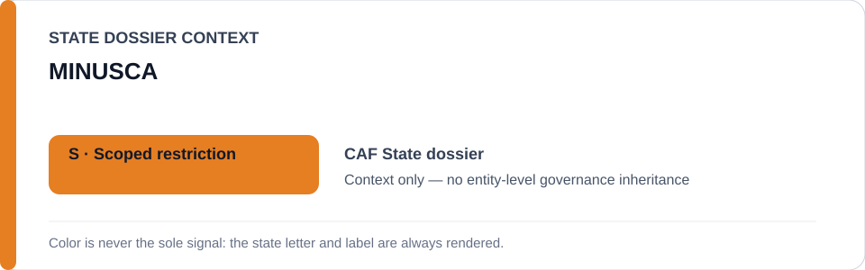
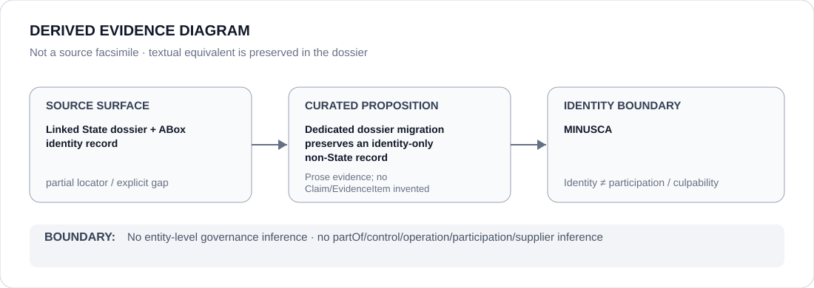

# MINUSCA

- Entity ID: `ORG-MINUSCA`
- Entity type: `Organization`

## Identity scope
Dedicated canonical record for `ORG-MINUSCA`.
## Linked governance context
Migration source: `dossiers/states/CAF.md`; mission reporting/remediation provenance is contextual only.
## Evidence record
This migration asserts no new event, relationship, or outcome.
## Attribution and exclusions
Reporting by the mission does not propagate attribution to other entities.
## Visual evidence

## Evidence gaps
Direct entity evidence beyond the linked source remains to be curated where absent.
## Sources
- `knowledge/entities/ORG-MINUSCA.json`
- `dossiers/states/CAF.md`
## Governance boundary
This Organization dossier does not classify a State or inherit linked-State governance status.
