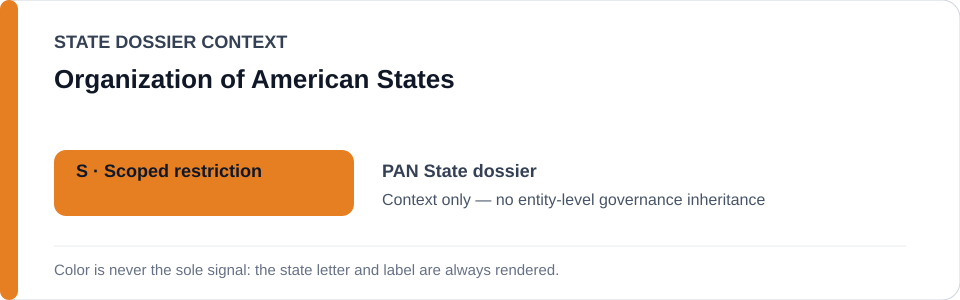
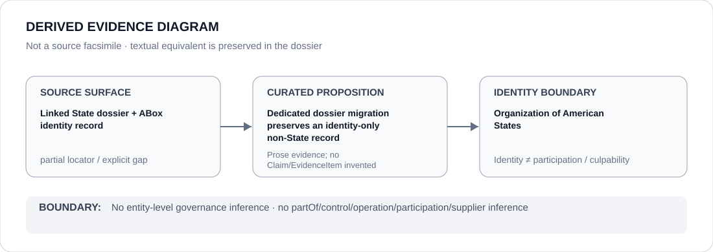

# Organization of American States

- Entity ID: `ORG-OAS`
- Entity type: `Organization`

## Identity scope
Dedicated canonical record for `ORG-OAS`.
## Linked governance context
Migration source: `dossiers/states/PAN.md`; membership and regional context do not transfer member-State attribution.
## Evidence record
This migration asserts no new event, relationship, or ECL outcome.
## Attribution and exclusions
Human-rights and institutional context remains proposition-specific.
## Visual evidence

## Evidence gaps
Direct entity evidence beyond the linked source remains to be curated where absent.
## Sources
- `knowledge/entities/ORG-OAS.json`
- `dossiers/states/PAN.md`
## Governance boundary
This Organization dossier does not classify a State or inherit linked-State governance status.
