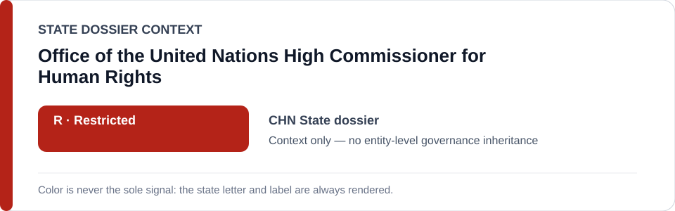
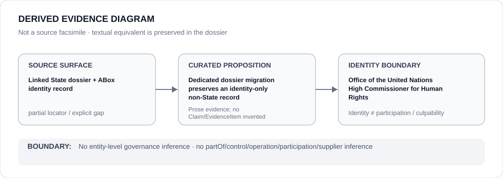

# Office of the United Nations High Commissioner for Human Rights

- Entity ID: `ORG-OHCHR`
- Entity type: `Organization`

## Identity scope
Dedicated canonical record for `ORG-OHCHR`.
## Linked governance context
Migration source: `dossiers/states/CHN.md`; monitoring, evidence, and cooperation provenance are contextual only.
## Evidence record
This migration asserts no new event, relationship, or governance outcome.
## Attribution and exclusions
OHCHR reporting does not mechanically create ECL governance or transfer attribution.
## Visual evidence

## Evidence gaps
Direct entity evidence beyond the linked source remains to be curated where absent.
## Sources
- `knowledge/entities/ORG-OHCHR.json`
- `dossiers/states/CHN.md`
## Governance boundary
This Organization dossier does not classify a State or inherit linked-State governance status.
