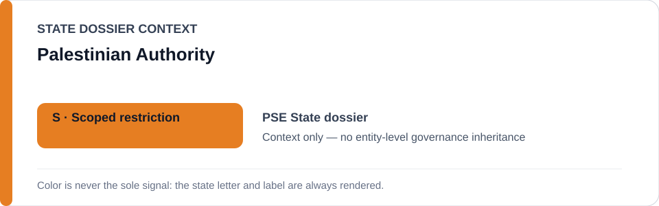
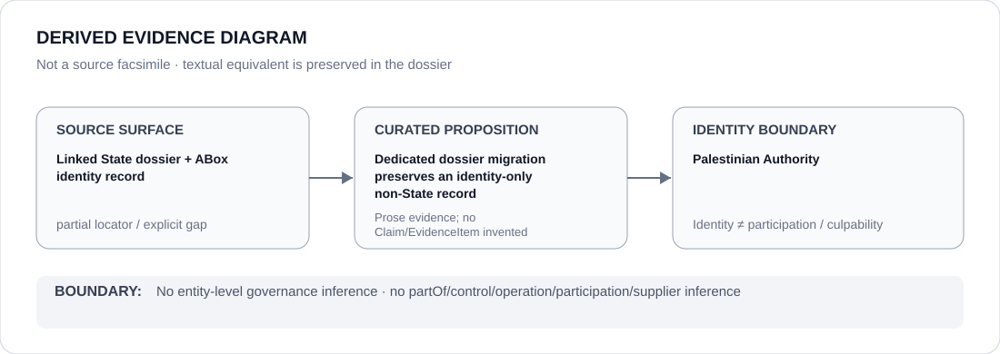

# Palestinian Authority

- Entity ID: `ORG-PSE-PALESTINIAN-AUTHORITY`
- Entity type: `Organization`

## Identity scope
Dedicated canonical record for `ORG-PSE-PALESTINIAN-AUTHORITY`.
## Linked governance context
Migration source: `dossiers/states/PSE.md`; the Palestine dossier's attribution split is preserved.
## Evidence record
This migration asserts no new conduct, project attribution, or governance result.
## Attribution and exclusions
PA attribution does not propagate from the State or to unrelated Palestinian actors.
## Visual evidence

## Evidence gaps
Direct entity evidence beyond the linked source remains to be curated where absent.
## Sources
- `knowledge/entities/ORG-PSE-PALESTINIAN-AUTHORITY.json`
- `dossiers/states/PSE.md`
## Governance boundary
This Organization dossier does not classify a State or inherit linked-State governance status.
