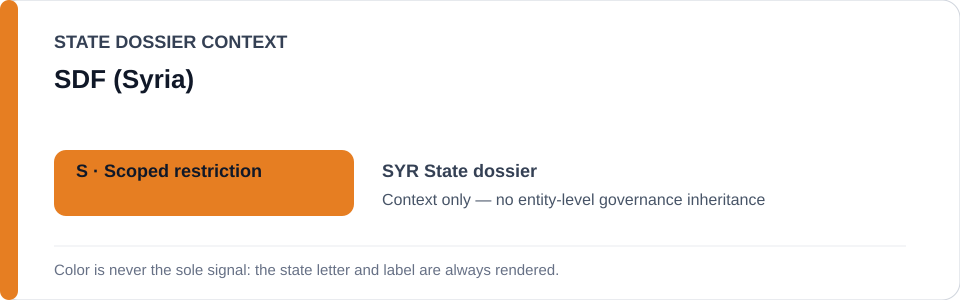
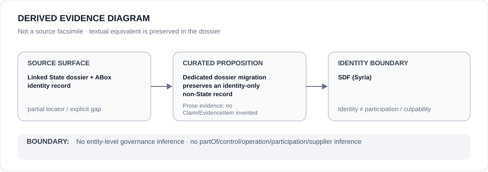

# SDF (Syria)

- Entity ID: `ORG-SYR-SDF`
- Entity type: `Organization`

## Identity scope
Dedicated canonical record for `ORG-SYR-SDF`.
## Linked governance context
Source: `dossiers/states/SYR.md`; fragmented context does not transfer attribution.
## Evidence record
No new conduct or relationship is asserted by this migration.
## Attribution and exclusions
The SDF remains separate from transitional-government attribution.
## Visual evidence

## Evidence gaps
Direct entity evidence remains to be curated where absent.
## Sources
- `knowledge/entities/ORG-SYR-SDF.json`
- `dossiers/states/SYR.md`
## Governance boundary
No linked-State status is inherited.
