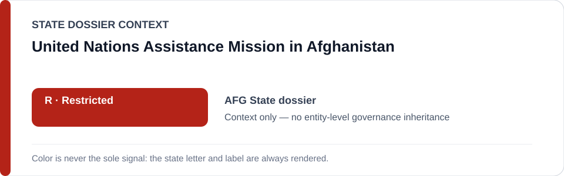
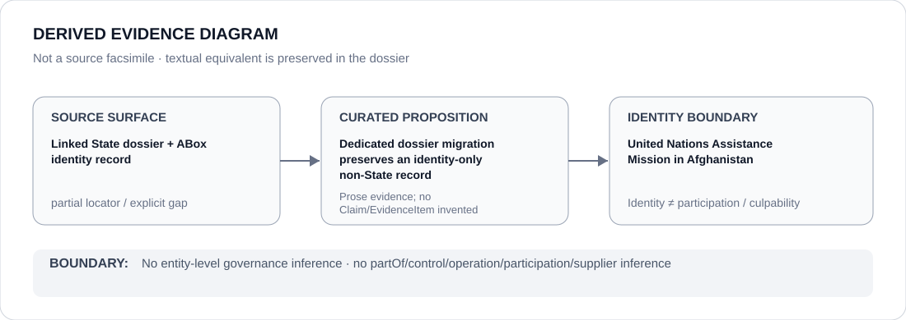

# United Nations Assistance Mission in Afghanistan

- Entity ID: `ORG-UNAMA`
- Entity type: `Organization`

## Identity scope
Dedicated canonical record for `ORG-UNAMA`.
## Linked governance context
Source: `dossiers/states/AFG.md`; mission reporting is evidence provenance only.
## Evidence record
No new event, relationship, or outcome is asserted.
## Attribution and exclusions
Reporting does not itself create an ECL outcome.
## Visual evidence

## Evidence gaps
Direct entity evidence remains to be curated where absent.
## Sources
- `knowledge/entities/ORG-UNAMA.json`
- `dossiers/states/AFG.md`
## Governance boundary
No linked-State status is inherited.
