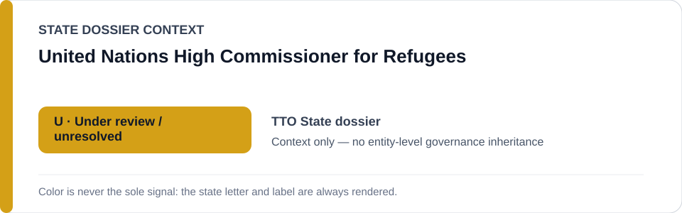
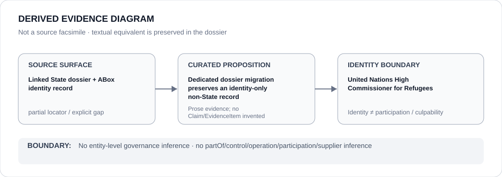

# United Nations High Commissioner for Refugees

- Entity ID: `ORG-UNHCR`
- Entity type: `Organization`

## Identity scope
Dedicated canonical record for `ORG-UNHCR`.
## Linked governance context
Source: `dossiers/states/TTO.md`; protection/access-remedy context remains proposition-specific.
## Evidence record
No new event, relationship, or outcome is asserted.
## Attribution and exclusions
Obstruction or cooperation requires separate evidence.
## Visual evidence

## Evidence gaps
Direct entity evidence remains to be curated where absent.
## Sources
- `knowledge/entities/ORG-UNHCR.json`
- `dossiers/states/TTO.md`
## Governance boundary
No linked-State status is inherited.
