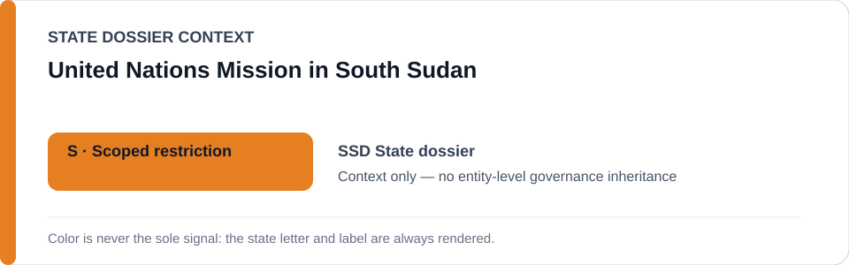
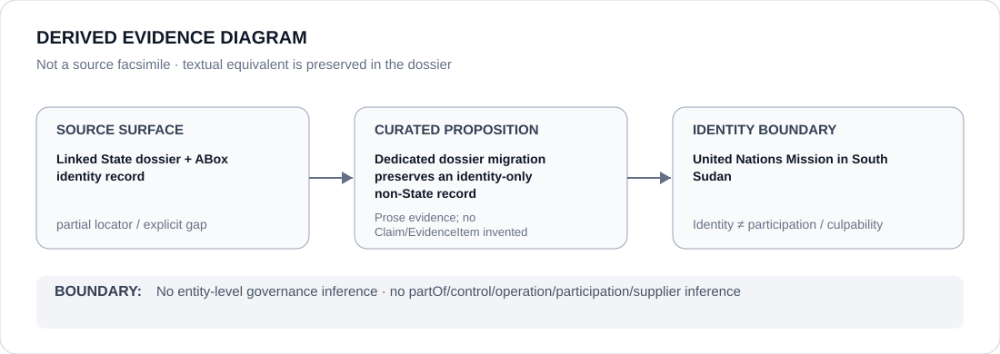

# United Nations Mission in South Sudan

- Entity ID: `ORG-UNMISS`
- Entity type: `Organization`

## Identity scope
Dedicated canonical record for `ORG-UNMISS`.
## Linked governance context
Source: `dossiers/states/SSD.md`; mission reporting and assistance are provenance only.
## Evidence record
No new event, relationship, or outcome is asserted.
## Attribution and exclusions
Reporting or assistance does not create governance.
## Visual evidence

## Evidence gaps
Direct entity evidence remains to be curated where absent.
## Sources
- `knowledge/entities/ORG-UNMISS.json`
- `dossiers/states/SSD.md`
## Governance boundary
No linked-State status is inherited.
