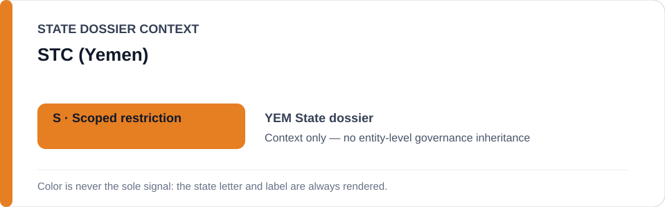
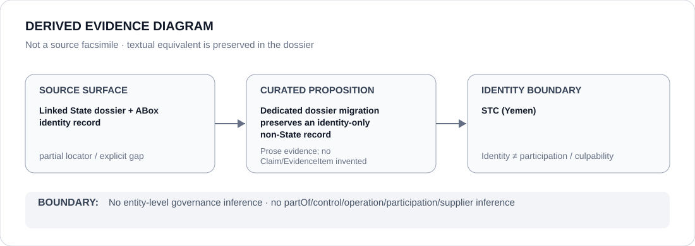

# STC (Yemen)

- Entity ID: `ORG-YEM-STC`
- Entity type: `Organization`

## Identity scope
Dedicated canonical record for `ORG-YEM-STC`.
## Linked governance context
Source: `dossiers/states/YEM.md`; conflict-party fragmentation remains explicit.
## Evidence record
No new conduct or relationship is asserted.
## Attribution and exclusions
Conduct does not propagate across rival Yemeni actors.
## Visual evidence

## Evidence gaps
Direct entity evidence remains to be curated where absent.
## Sources
- `knowledge/entities/ORG-YEM-STC.json`
- `dossiers/states/YEM.md`
## Governance boundary
No linked-State status is inherited.
