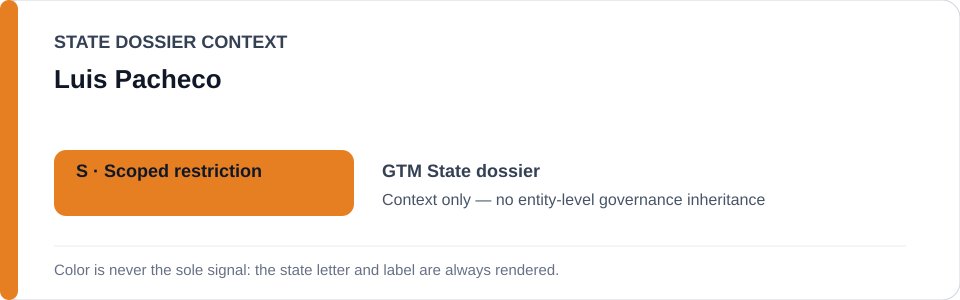
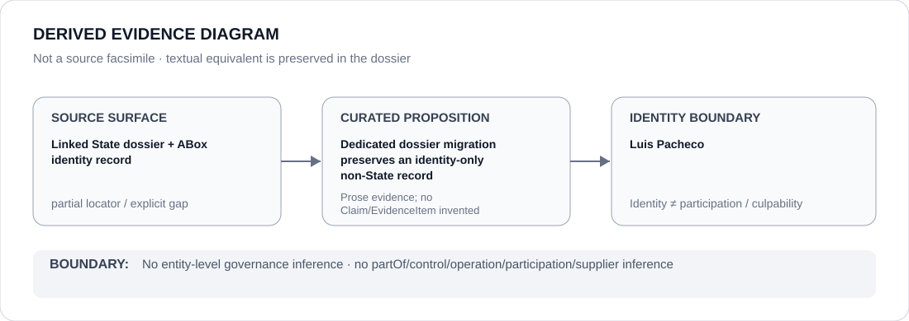

# Luis Pacheco

> **Canonical per-entity evidence/provenance record.** This dossier has no licensing effect by itself and carries no standalone `provisional_outcome`.

## Identity scope

Luis Pacheco is preserved here only as the canonical person identity already present in the ABox at the comparison base. This migration creates a dedicated identity boundary; it does not add relationships, attribution, participation, culpability or governance semantics.

## State governance context

The canonical `GTM` State dossier remains the provenance context for this identity. The status card below is generated from the current State dossier at render time. State governance is context only and is not inherited by Luis Pacheco.

## Evidence record

At the comparison base, the existing ABox record for `PERSON-GTM-LUIS-PACHECO` pointed to `dossiers/states/GTM.md`. This v50 migration changes only that dossier pointer so the already-reviewed identity has its own canonical evidence/provenance surface.

## Attribution and exclusions

Identity materialization does not establish operation, control, supply, command, participation, culpability, Material Participation or any ECL governance outcome. Those propositions require separate reviewed evidence.

## Visual evidence

The diagram represents the repository-local State-dossier provenance, the dedicated identity record and the explicit non-inference boundary. Its textual equivalent is preserved in this dossier.

## Evidence gaps

This migration adds no new external factual proposition and does not expand the evidentiary scope of the existing ABox review record. Any conduct, relationship or project-specific attribution remains outside this identity-only migration unless separately curated.

## Sources

- [Canonical GTM State dossier](../states/GTM.md)

## Governance boundary

A dedicated dossier makes the identity auditable; it does not make the identity governed, restricted, responsible for adjacent conduct or a participant in any project merely because it appears in State-context evidence.
