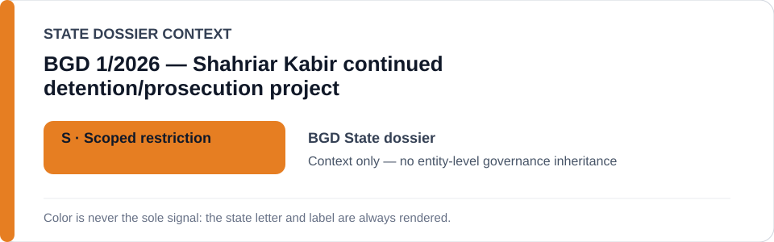
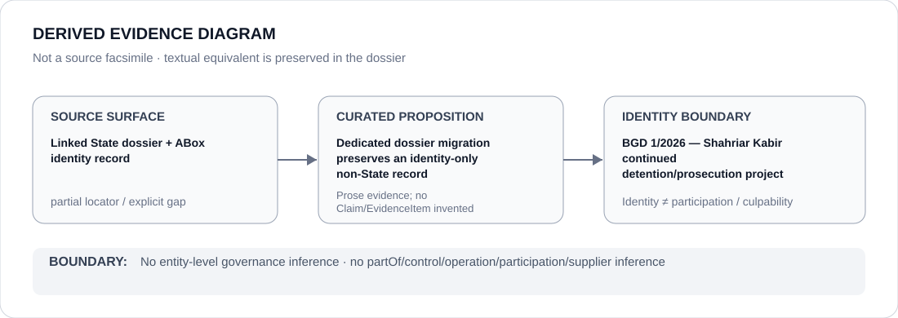

# Shahriar Kabir case (BGD.1/2026)

- Entity ID: `PROJECT-BGD-SHAHRIAR-KABIR-BGD-1-2026`
- Entity type: `Project`

## Identity scope
Dedicated canonical record for this bounded case/project.
## Linked governance context
Source: `dossiers/states/BGD.md`; the State record supplies context only.
## Evidence record
The migration asserts no new actor participation, guilt, or governance result.
## Attribution and exclusions
Case-specific propositions remain separate from State and institutional identities.
## Visual evidence

## Evidence gaps
Additional project-level evidence remains to be curated where absent.
## Sources
- `knowledge/entities/PROJECT-BGD-SHAHRIAR-KABIR-BGD-1-2026.json`
- `dossiers/states/BGD.md`
## Governance boundary
This Project dossier does not inherit a linked State's governance status.
