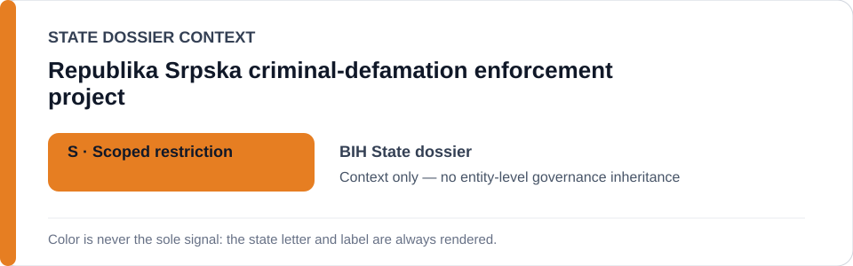
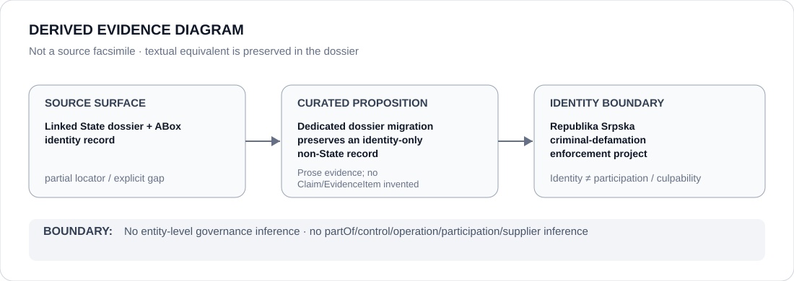

# Republika Srpska criminal-defamation enforcement project

- Entity ID: `PROJECT-BIH-RS-CRIMINAL-DEFAMATION-ENFORCEMENT`
- Entity type: `Project`

## Identity scope
Dedicated record bounded to Articles 208a-208đ enforcement.
## Linked governance context
Source: `dossiers/states/BIH.md`; context does not expand the project boundary.
## Evidence record
No individual prosecution or prosecutor-office participation is inferred.
## Attribution and exclusions
Individual proceedings remain separate Claims.
## Visual evidence

## Evidence gaps
Project-specific evidence remains to be curated where absent.
## Sources
- `knowledge/entities/PROJECT-BIH-RS-CRIMINAL-DEFAMATION-ENFORCEMENT.json`
- `dossiers/states/BIH.md`
## Governance boundary
This Project dossier does not inherit a State outcome.
