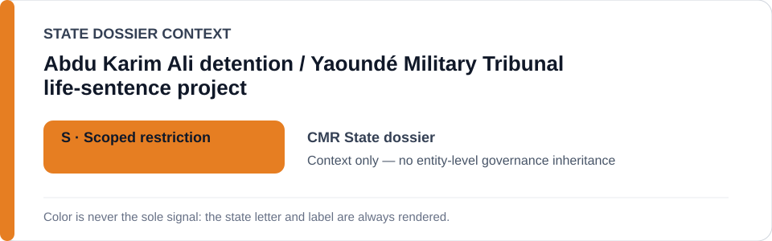
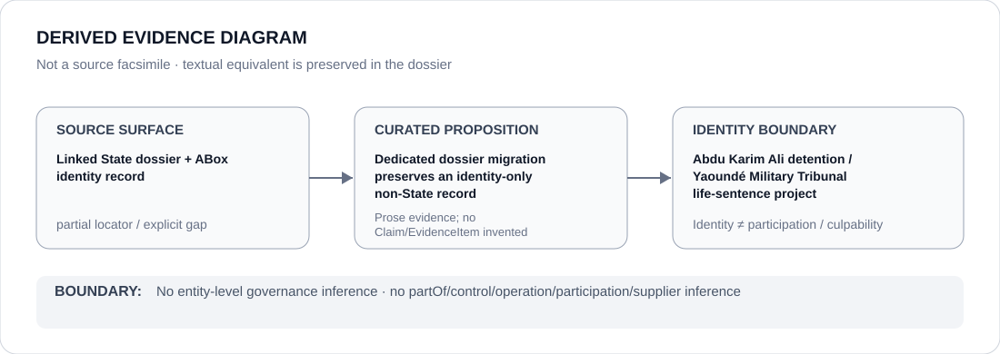

# Abdu Karim Ali detention / Yaoundé Military Tribunal life-sentence project

- Entity ID: `PROJECT-CMR-ABDU-KARIM-ALI-DETENTION`
- Entity type: `Project`

## Identity scope
Dedicated canonical record for the exact case project.
## Linked governance context
Source: `dossiers/states/CMR.md`; contextual linkage is non-propagating.
## Evidence record
No tribunal/detention actor participation or governance is inferred from identity.
## Attribution and exclusions
Actor relations require separate evidence.
## Visual evidence

## Evidence gaps
Project-specific evidence remains to be curated where absent.
## Sources
- `knowledge/entities/PROJECT-CMR-ABDU-KARIM-ALI-DETENTION.json`
- `dossiers/states/CMR.md`
## Governance boundary
This Project dossier does not inherit a State outcome.
