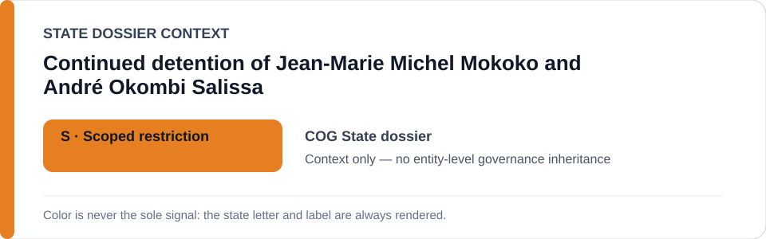
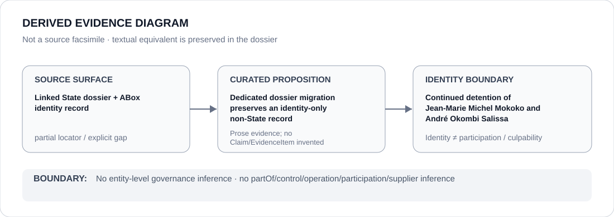

# Continued detention of Jean-Marie Michel Mokoko and André Okombi Salissa

- Entity ID: `PROJECT-COG-MOKOKO-SALISSA-CONTINUED-DETENTION`
- Entity type: `Project`

## Identity scope
Dedicated record for the exact two-person continued-detention project.
## Linked governance context
Source: `dossiers/states/COG.md`; State context does not create actor participation.
## Evidence record
No detention/prosecution actor is inferred by this migration.
## Attribution and exclusions
Case propositions remain separately evidenced.
## Visual evidence

## Evidence gaps
Direct project evidence remains to be curated where absent.
## Sources
- `knowledge/entities/PROJECT-COG-MOKOKO-SALISSA-CONTINUED-DETENTION.json`
- `dossiers/states/COG.md`
## Governance boundary
No linked-State governance outcome is inherited.
