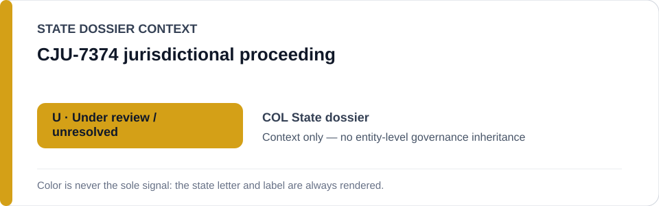
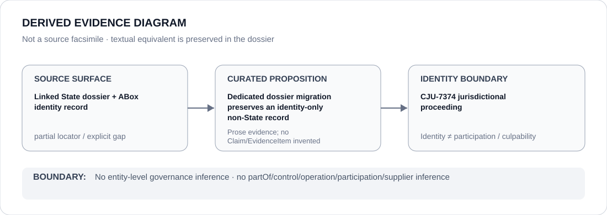

# CJU-7374 jurisdictional proceeding

- Entity ID: `PROJECT-COL-CJU-7374`
- Entity type: `Project`

## Identity scope
Dedicated record for the bounded `CJU-7374` proceeding.
## Linked governance context
Source: `dossiers/states/COL.md`.
## Evidence record
The object preserves counter/uncertainty evidence and carries no governance outcome.
## Attribution and exclusions
No military-jurisdiction obstruction is inferred from identity alone.
## Visual evidence

## Evidence gaps
Direct project evidence remains to be curated where absent.
## Sources
- `knowledge/entities/PROJECT-COL-CJU-7374.json`
- `dossiers/states/COL.md`
## Governance boundary
No linked-State governance outcome is inherited.
