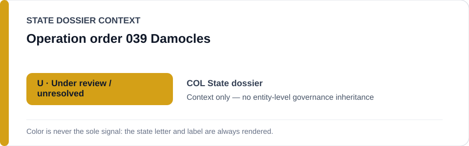
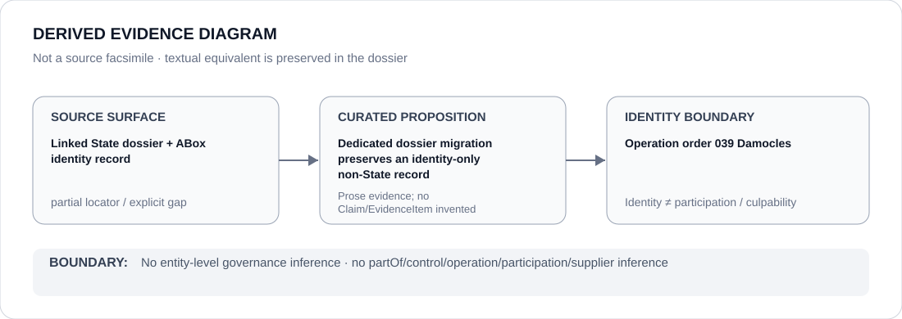

# Operation order 039 Damocles

- Entity ID: `PROJECT-COL-OPERATION-DAMOCLES`
- Entity type: `Project`

## Identity scope
Dedicated record for the exact named operation-order object.
## Linked governance context
Source: `dossiers/states/COL.md`.
## Evidence record
Identity alone establishes no operator relation or ECL outcome.
## Attribution and exclusions
Operator relations require separate Claims.
## Visual evidence

## Evidence gaps
Direct project evidence remains to be curated where absent.
## Sources
- `knowledge/entities/PROJECT-COL-OPERATION-DAMOCLES.json`
- `dossiers/states/COL.md`
## Governance boundary
No linked-State governance outcome is inherited.
