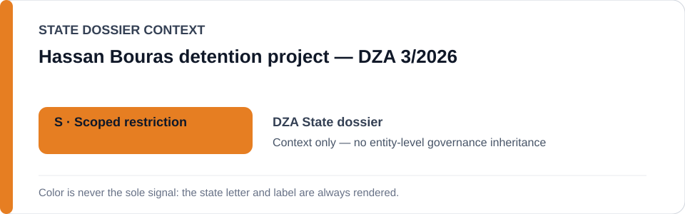
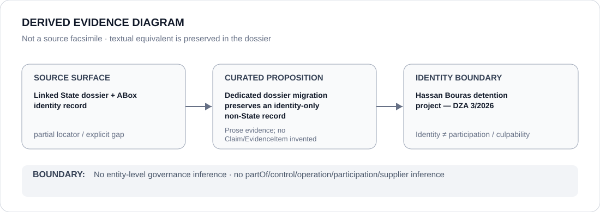

# Hassan Bouras detention project — DZA 3/2026

- Entity ID: `PROJECT-DZA-HASSAN-BOURAS-DZA-3-2026`
- Entity type: `Project`

## Identity scope
Dedicated record for the exact case project.
## Linked governance context
Source: `dossiers/states/DZA.md`.
## Evidence record
Actor participation and governance remain separate propositions.
## Attribution and exclusions
No institutional relation is inferred from case identity.
## Visual evidence

## Evidence gaps
Direct project evidence remains to be curated where absent.
## Sources
- `knowledge/entities/PROJECT-DZA-HASSAN-BOURAS-DZA-3-2026.json`
- `dossiers/states/DZA.md`
## Governance boundary
No linked-State governance outcome is inherited.
