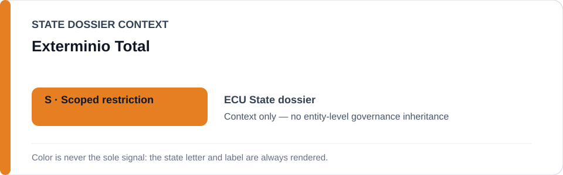
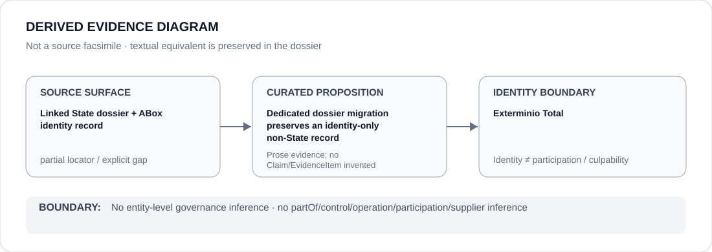

# Exterminio Total

- Entity ID: `PROJECT-ECU-EXTERMINIO-TOTAL`
- Entity type: `Project`
## Identity scope
Dedicated record for the exact named project.
## Linked governance context
Source: `dossiers/states/ECU.md`.
## Evidence record
Identity alone establishes no operator, attribution, or governance outcome.
## Attribution and exclusions
Operator relations require separate evidence.
## Visual evidence

## Evidence gaps
Direct project evidence remains to be curated where absent.
## Sources
- `knowledge/entities/PROJECT-ECU-EXTERMINIO-TOTAL.json`
- `dossiers/states/ECU.md`
## Governance boundary
No linked-State outcome is inherited.
