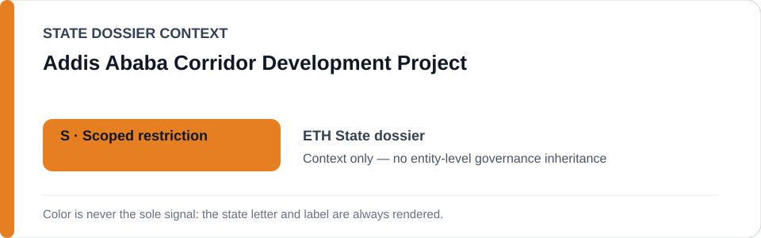
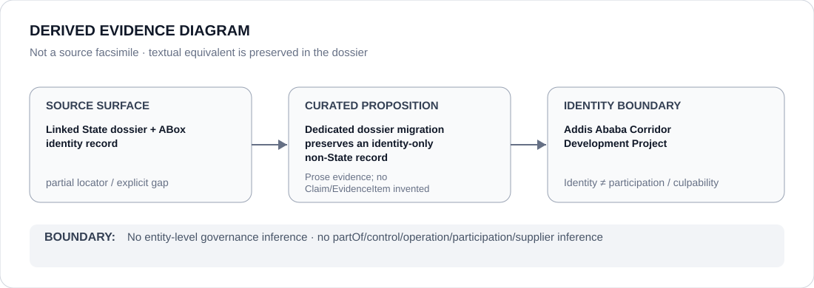

# Addis Ababa Corridor Development Project

- Entity ID: `PROJECT-ETH-ADDIS-ABABA-CORRIDOR-DEVELOPMENT`
- Entity type: `Project`
## Identity scope
Dedicated record for the named corridor project.
## Linked governance context
Source: `dossiers/states/ETH.md`.
## Evidence record
Ordinary construction and rights-compliant relocation are not qualifying conduct by identity alone.
## Attribution and exclusions
Conduct and governance propositions remain independently evidenced.
## Visual evidence

## Evidence gaps
Direct project evidence remains to be curated where absent.
## Sources
- `knowledge/entities/PROJECT-ETH-ADDIS-ABABA-CORRIDOR-DEVELOPMENT.json`
- `dossiers/states/ETH.md`
## Governance boundary
No linked-State outcome is inherited.
