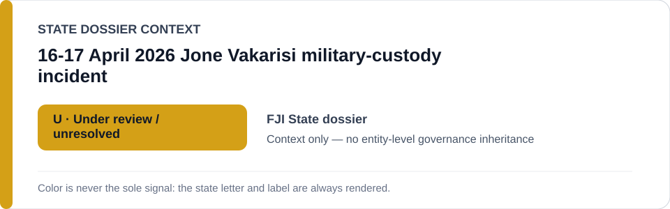
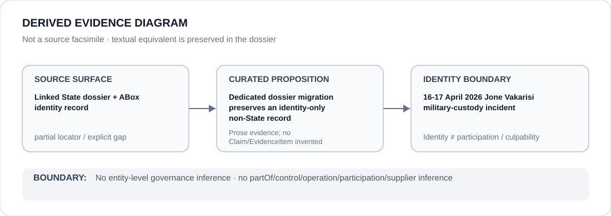

# 16-17 April 2026 Jone Vakarisi military-custody incident

- Entity ID: `PROJECT-FJI-VAKARISI-CUSTODY-2026-04`
- Entity type: `Project`
## Identity scope
Dedicated record for the bounded historical incident.
## Linked governance context
Source: `dossiers/states/FJI.md`.
## Evidence record
A past incident alone does not create an open-ended Schedule class; current continuity remains unresolved.
## Attribution and exclusions
Current workflow continuity requires separate evidence.
## Visual evidence

## Evidence gaps
Direct project evidence remains to be curated where absent.
## Sources
- `knowledge/entities/PROJECT-FJI-VAKARISI-CUSTODY-2026-04.json`
- `dossiers/states/FJI.md`
## Governance boundary
No linked-State outcome is inherited.
