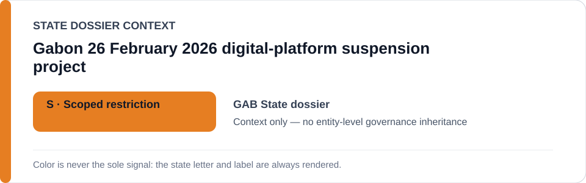
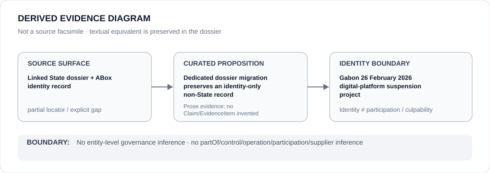

# Gabon 26 February 2026 digital-platform suspension project

- Entity ID: `PROJECT-GAB-PLATFORM-SUSPENSION-2026-02-26`
- Entity type: `Project`
## Identity scope
Dedicated record for the exact platform-suspension project.
## Linked governance context
Source: `dossiers/states/GAB.md`.
## Evidence record
Later governance dialogue and unrelated administration remain distinct.
## Attribution and exclusions
No implementing actor is inferred from identity alone.
## Visual evidence

## Evidence gaps
Direct project evidence remains to be curated where absent.
## Sources
- `knowledge/entities/PROJECT-GAB-PLATFORM-SUSPENSION-2026-02-26.json`
- `dossiers/states/GAB.md`
## Governance boundary
No linked-State outcome is inherited.
