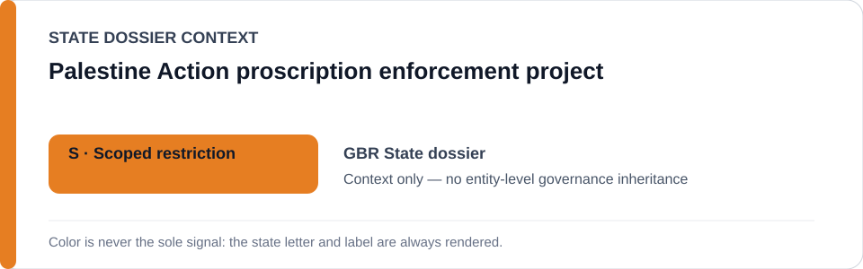
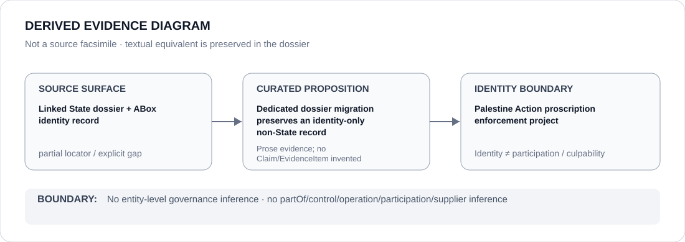

# Palestine Action proscription enforcement project

- Entity ID: `PROJECT-GBR-PALESTINE-ACTION-PROSCRIPTION-ENFORCEMENT`
- Entity type: `Project`
## Identity scope
Dedicated record for the bounded post-5-July-2025 statutory enforcement project.
## Linked governance context
Source: `dossiers/states/GBR.md`.
## Evidence record
Ordinary counterterrorism enforcement is not included by this identity.
## Attribution and exclusions
Specific enforcement acts remain separately evidenced.
## Visual evidence

## Evidence gaps
Direct project evidence remains to be curated where absent.
## Sources
- `knowledge/entities/PROJECT-GBR-PALESTINE-ACTION-PROSCRIPTION-ENFORCEMENT.json`
- `dossiers/states/GBR.md`
## Governance boundary
No linked-State outcome is inherited.
