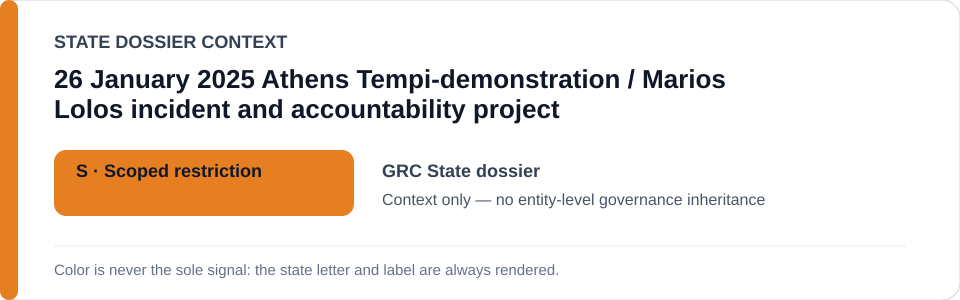
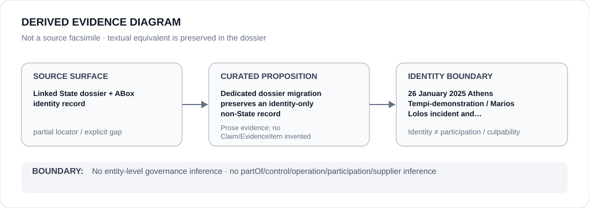

# 26 January 2025 Athens Tempi-demonstration / Marios Lolos incident and accountability project

- Entity ID: `PROJECT-GRC-MARIOS-LOLOS-2025-01-26`
- Entity type: `Project`
## Identity scope
Dedicated record for the exact incident/accountability project.
## Linked governance context
Source: `dossiers/states/GRC.md`.
## Evidence record
Police or subunit participation is not inferred from project identity.
## Attribution and exclusions
Actor participation requires separate evidence.
## Visual evidence

## Evidence gaps
Direct project evidence remains to be curated where absent.
## Sources
- `knowledge/entities/PROJECT-GRC-MARIOS-LOLOS-2025-01-26.json`
- `dossiers/states/GRC.md`
## Governance boundary
No linked-State outcome is inherited.
