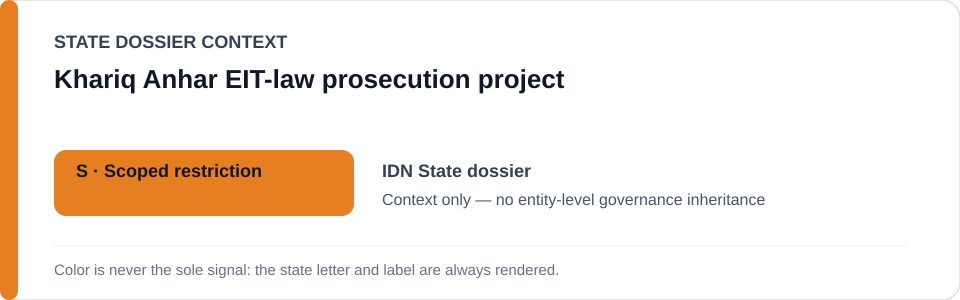
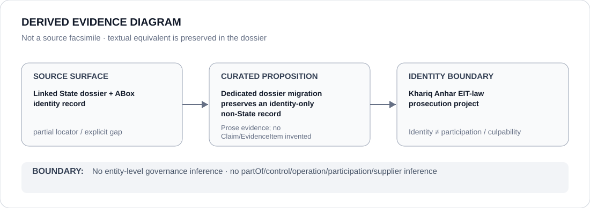

# Khariq Anhar EIT-law prosecution project

- Entity ID: `PROJECT-IDN-KHARIQ-ANHAR-EIT-PROSECUTION`
- Entity type: `Project`
## Identity scope
Dedicated record for the exact prosecution project.
## Linked governance context
Source: `dossiers/states/IDN.md`.
## Evidence record
No prosecution authority participation or governance is inferred.
## Attribution and exclusions
Institutional relations remain separately evidenced.
## Visual evidence

## Evidence gaps
Direct project evidence remains to be curated where absent.
## Sources
- `knowledge/entities/PROJECT-IDN-KHARIQ-ANHAR-EIT-PROSECUTION.json`
- `dossiers/states/IDN.md`
## Governance boundary
No linked-State outcome is inherited.
