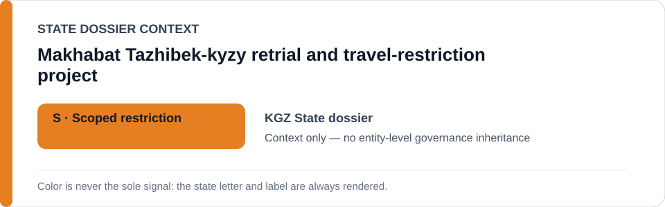
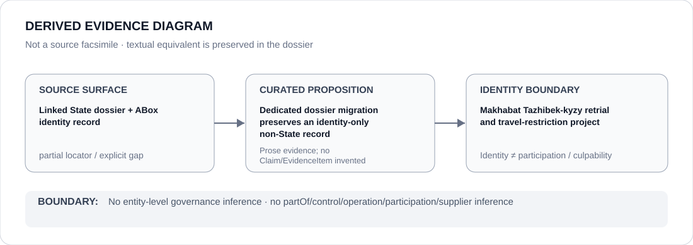

# Makhabat Tazhibek-kyzy retrial and travel-restriction project

- Entity ID: `PROJECT-KGZ-MAKHABAT-TAZHIBEK-KYZY-RETRIAL`
- Entity type: `Project`
## Identity scope
Dedicated record for the exact proceeding project.
## Linked governance context
Source: `dossiers/states/KGZ.md`.
## Evidence record
No court/prosecutor actor relation or governance is inferred.
## Attribution and exclusions
Actor relations remain separate evidence propositions.
## Visual evidence

## Evidence gaps
Direct project evidence remains to be curated where absent.
## Sources
- `knowledge/entities/PROJECT-KGZ-MAKHABAT-TAZHIBEK-KYZY-RETRIAL.json`
- `dossiers/states/KGZ.md`
## Governance boundary
No linked-State outcome is inherited.
