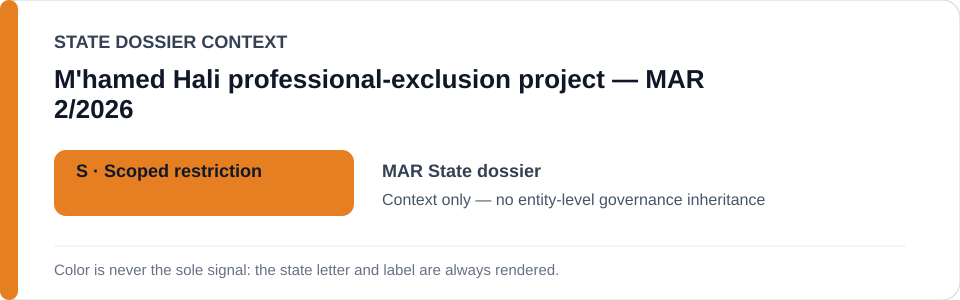
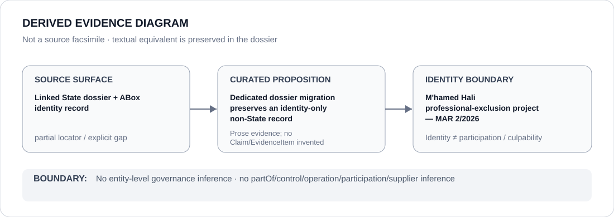

# M'hamed Hali professional-exclusion project — MAR 2/2026

## Identity scope
Canonical identity `PROJECT-MAR-MHAMED-HALI-PROFESSIONAL-EXCLUSION`; ABox metadata remains authoritative.
## State governance context
`MAR` context is `S` only; no entity-level governance inheritance.
## Evidence record
Dedicated dossier migration only; no Claim, EvidenceItem, relation, participation or licensing effect is created.
## Attribution and exclusions
Identity or adjacency does not infer partOf, sameAs, control, operation, participation, supply, command, membership or culpability.
## Visual evidence

## Evidence gaps
Source granularity: `partial`; proposition-specific gaps remain open.
## Sources
- `knowledge/entities/PROJECT-MAR-MHAMED-HALI-PROFESSIONAL-EXCLUSION.json`
- `dossiers/states/MAR.md`
## Governance boundary
This dossier records identity and context only; it does not independently establish an ECL restriction.
