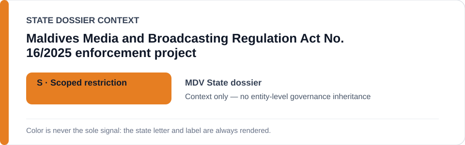
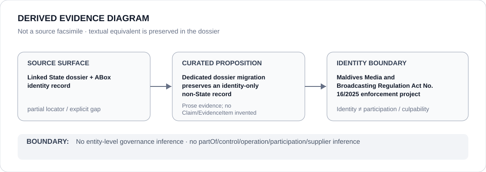

# Maldives Media and Broadcasting Regulation Act No. 16/2025 enforcement project

- Entity ID: `PROJECT-MDV-ACT-16-2025-MEDIA-ENFORCEMENT`
- Entity type: `Project`
## Identity scope
Dedicated record for the bounded statutory-enforcement project.
## Linked governance context
Source: `dossiers/states/MDV.md`.
## Evidence record
Whether a specific enforcement act satisfies ECL §5 remains an independent proposition.
## Attribution and exclusions
Statutory identity alone does not establish qualifying conduct.
## Visual evidence

## Evidence gaps
Direct project evidence remains to be curated where absent.
## Sources
- `knowledge/entities/PROJECT-MDV-ACT-16-2025-MEDIA-ENFORCEMENT.json`
- `dossiers/states/MDV.md`
## Governance boundary
No linked-State outcome is inherited.
