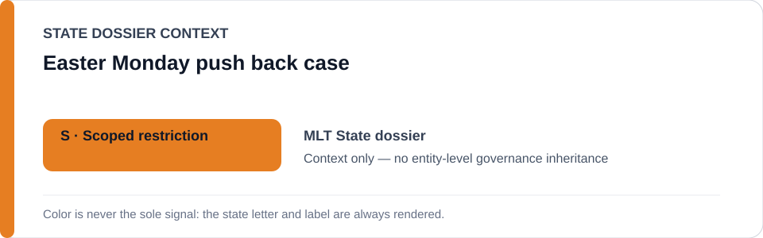
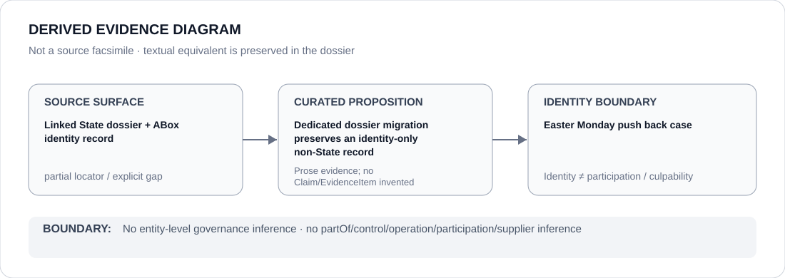

# Easter Monday push back case

- Entity ID: `PROJECT-MLT-EASTER-MONDAY-PUSH-BACK-CASE`
- Entity type: `Project`
## Identity scope
Dedicated record for the bounded litigation/remediation object.
## Linked governance context
Source: `dossiers/states/MLT.md`.
## Evidence record
The retrial/remedial record is preserved without making the case or court a Restricted Project.
## Attribution and exclusions
Remedial evidence remains proposition-specific.
## Visual evidence

## Evidence gaps
Direct project evidence remains to be curated where absent.
## Sources
- `knowledge/entities/PROJECT-MLT-EASTER-MONDAY-PUSH-BACK-CASE.json`
- `dossiers/states/MLT.md`
## Governance boundary
No linked-State outcome is inherited.
