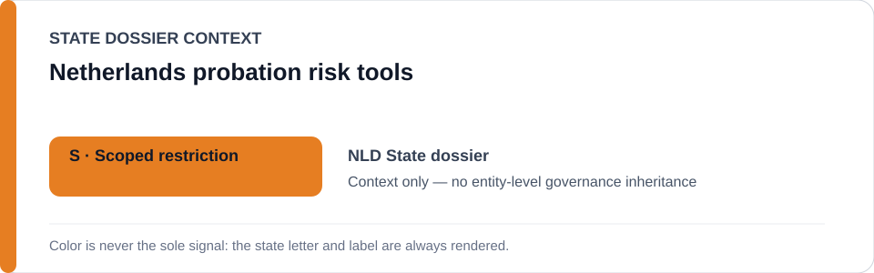
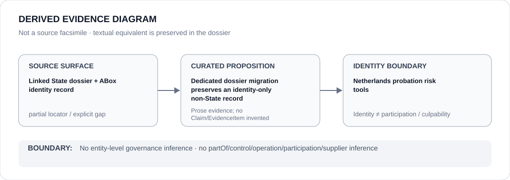

# Netherlands probation risk tools

- Entity ID: `PROJECT-NLD-PROBATION-RISK-TOOLS`
- Entity type: `Project`
## Identity scope
Dedicated record for the scoped probation-risk-tools project.
## Linked governance context
Source: `dossiers/states/NLD.md`.
## Evidence record
The project identity follows the canonical State dossier pending dedicated evidence curation.
## Attribution and exclusions
Identity alone does not create a governance outcome.
## Visual evidence

## Evidence gaps
Direct project evidence remains to be curated where absent.
## Sources
- `knowledge/entities/PROJECT-NLD-PROBATION-RISK-TOOLS.json`
- `dossiers/states/NLD.md`
## Governance boundary
No linked-State outcome is inherited.
