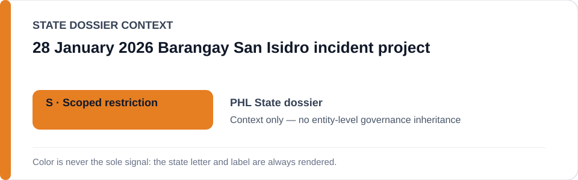
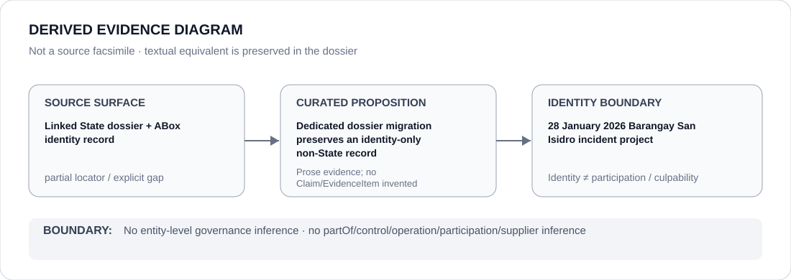

# 28 January 2026 Barangay San Isidro incident project

- Entity ID: `PROJECT-PHL-SAN-ISIDRO-2026-01-28-INCIDENT`
- Entity type: `Project`
## Identity scope
Dedicated record for the pending criminal/administrative incident boundary.
## Linked governance context
Source: `dossiers/states/PHL.md`.
## Evidence record
This identity is not a finding of individual criminal guilt.
## Attribution and exclusions
It does not classify PNP, MPD, station personnel, or other actors generally.
## Visual evidence

## Evidence gaps
Direct project evidence remains to be curated where absent.
## Sources
- `knowledge/entities/PROJECT-PHL-SAN-ISIDRO-2026-01-28-INCIDENT.json`
- `dossiers/states/PHL.md`
## Governance boundary
No linked-State outcome is inherited.
