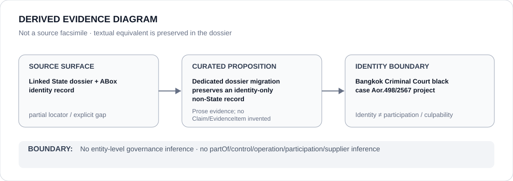

# Bangkok Criminal Court black case Aor.498/2567 project

- Entity ID: `PROJECT-THA-AOR-498-2567`
- Entity type: `Project`
## Identity scope
Dedicated record for the exact `Aor.498/2567` case/project boundary.
## Linked governance context
Source: `dossiers/states/THA.md`.
## Evidence record
The identity does not create a generic Section 112, court, prosecutor, police, or corrections class.
## Attribution and exclusions
Actor and class relations remain separately evidenced.
## Visual evidence

## Evidence gaps
Direct project evidence remains to be curated where absent.
## Sources
- `knowledge/entities/PROJECT-THA-AOR-498-2567.json`
- `dossiers/states/THA.md`
## Governance boundary
No linked-State outcome is inherited.
