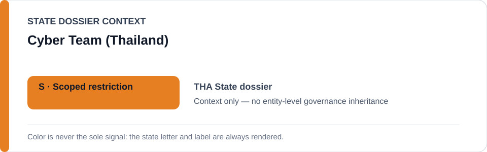
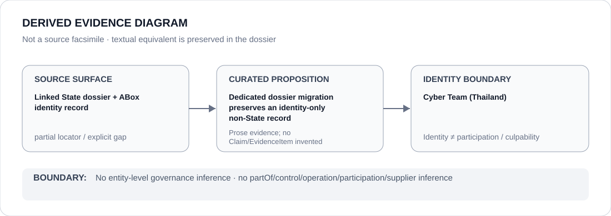

# Cyber Team (Thailand)

- Entity ID: `PROJECT-THA-CYBER-TEAM`
- Entity type: `Project`
## Identity scope
Dedicated record for the exact named coordinated information-control project.
## Linked governance context
Source: `dossiers/states/THA.md`.
## Evidence record
Operator relations remain separate Claims.
## Attribution and exclusions
Police/military participation is not inferred from identity alone.
## Visual evidence

## Evidence gaps
Direct project evidence remains to be curated where absent.
## Sources
- `knowledge/entities/PROJECT-THA-CYBER-TEAM.json`
- `dossiers/states/THA.md`
## Governance boundary
No linked-State outcome is inherited.
