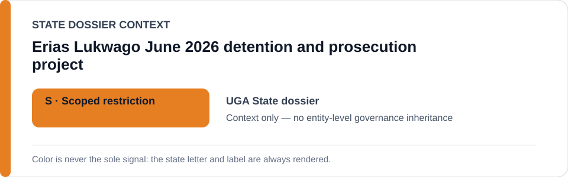
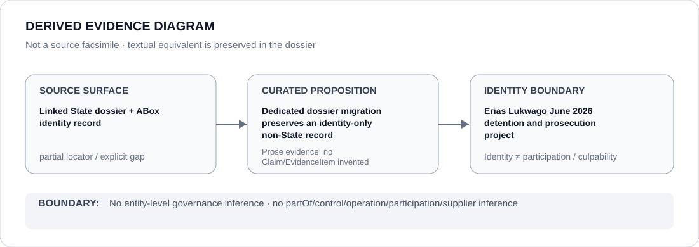

# Erias Lukwago June 2026 detention and prosecution project

- Entity ID: `PROJECT-UGA-ERIAS-LUKWAGO-2026`
- Entity type: `Project`
## Identity scope
Dedicated canonical record for the exact June 2026 case project.
## Linked governance context
Source: `dossiers/states/UGA.md`.
## Evidence record
Military, police, and prosecutor participation remains separately evidenced.
## Attribution and exclusions
No actor participation follows from project identity alone.
## Visual evidence

## Evidence gaps
Direct project evidence remains to be curated where absent.
## Sources
- `knowledge/entities/PROJECT-UGA-ERIAS-LUKWAGO-2026.json`
- `dossiers/states/UGA.md`
## Governance boundary
No linked-State governance outcome is inherited.
