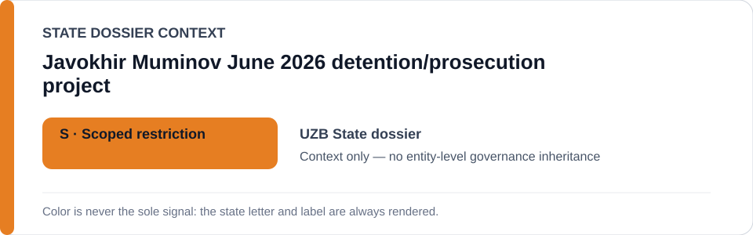
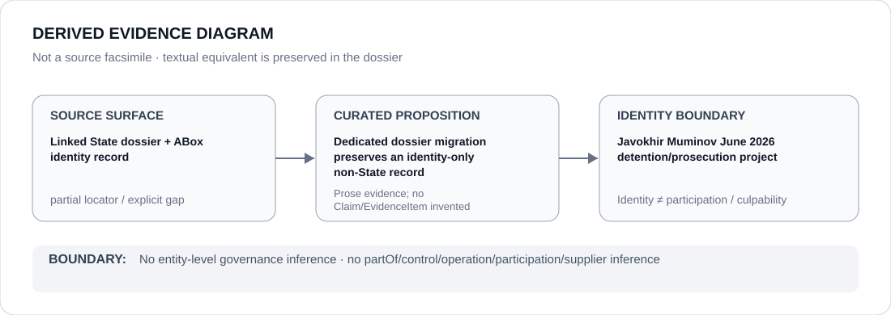

# Javokhir Muminov June 2026 detention/prosecution project

- Entity ID: `PROJECT-UZB-JAVOKHIR-MUMINOV-2026`
- Entity type: `Project`
## Identity scope
Dedicated canonical record for the exact June 2026 case project.
## Linked governance context
Source: `dossiers/states/UZB.md`.
## Evidence record
Custody and prosecution actor participation remains separate evidence.
## Attribution and exclusions
No actor relation follows from project identity alone.
## Visual evidence

## Evidence gaps
Direct project evidence remains to be curated where absent.
## Sources
- `knowledge/entities/PROJECT-UZB-JAVOKHIR-MUMINOV-2026.json`
- `dossiers/states/UZB.md`
## Governance boundary
No linked-State governance outcome is inherited.
