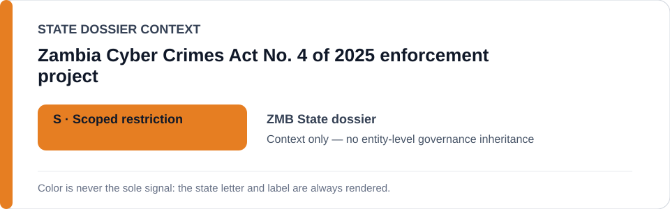
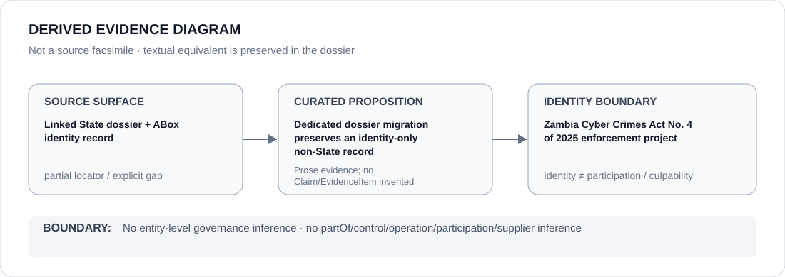

# Zambia Cyber Crimes Act No. 4 of 2025 enforcement project

- Entity ID: `PROJECT-ZMB-PECA-ENFORCEMENT`
- Entity type: `Project`
## Identity scope
Dedicated record for the statutory-enforcement project from the Zambia freeze.
## Linked governance context
Source: `dossiers/states/ZMB.md`.
## Evidence record
Protected-expression targeting and ECL criterion satisfaction remain case-specific propositions.
## Attribution and exclusions
Statutory identity alone does not establish qualifying conduct.
## Visual evidence

## Evidence gaps
Direct project evidence remains to be curated where absent.
## Sources
- `knowledge/entities/PROJECT-ZMB-PECA-ENFORCEMENT.json`
- `dossiers/states/ZMB.md`
## Governance boundary
No linked-State governance outcome is inherited.
