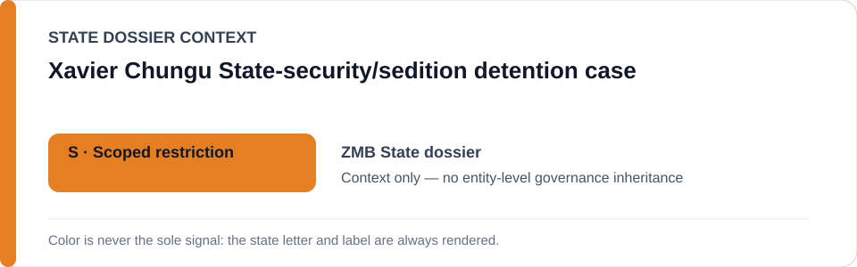
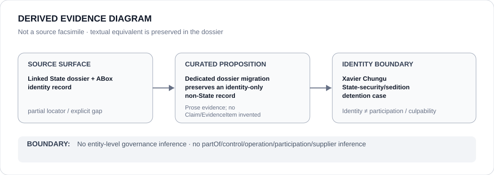

# Xavier Chungu State-security/sedition detention case

- Entity ID: `PROJECT-ZMB-XAVIER-CHUNGU-DETENTION`
- Entity type: `Project`
## Identity scope
Dedicated record for the bounded Xavier Chungu matter.
## Linked governance context
Source: `dossiers/states/ZMB.md`.
## Evidence record
Identity is not a finding of guilt or whole-agency status.
## Attribution and exclusions
Individual and institutional propositions remain separately evidenced.
## Visual evidence

## Evidence gaps
Direct project evidence remains to be curated where absent.
## Sources
- `knowledge/entities/PROJECT-ZMB-XAVIER-CHUNGU-DETENTION.json`
- `dossiers/states/ZMB.md`
## Governance boundary
No linked-State governance outcome is inherited.
